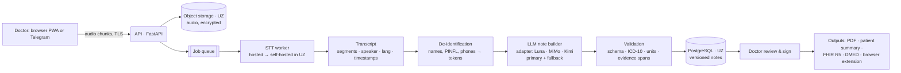

# Architecture (v1, to be refined each sprint)

## Principles
1. **Modular monolith first.** One API service plus one worker. We split services only when load or teams require it.
2. **Provider-agnostic AI.** STT and LLM sit behind adapters, so we can swap vendors or self-host without a rewrite.
3. **Structured-first.** Notes are versioned JSON with evidence spans, aligned with FHIR R5 (the DHP IG). Text is just one rendering.
4. **Privacy by design.** Audio and PII stay in Uzbekistan, only de-identified text reaches the LLM, and every access is audited.
5. **Eval-driven.** Every change to a prompt, model or STT setting runs against the eval set in CI.

## Stack (recommendation)

| Layer | Choice | Why |
|---|---|---|
| Web app | **Next.js (TypeScript)** as a PWA, Tailwind, i18n for `uz-Latn` / `uz-Cyrl` / `ru` | Runs on any phone or laptop browser with nothing to install, like Telepatía |
| Recording | MediaRecorder or AudioWorklet, Opus codec, chunked upload with an IndexedDB buffer | Works on unstable connections |
| API | **Python 3.11+ + FastAPI**, Pydantic, SQLAlchemy (Alembic from Sprint 2) | Python is the home of the speech and ML ecosystem (fine-tuning, self-hosted ASR) |
| Worker | Sprint 1: FastAPI background tasks in the API process. Sprint 3: arq or Celery on Redis | STT and LLM jobs, retries |
| Database | Sprint 1: SQLite. **PostgreSQL 16** from Sprint 2 (pgvector later for the CDSS knowledge base) | One reliable store |
| Object storage | S3-compatible: MinIO in dev, UzCloud S3 in prod | Audio stays in UZ |
| LLM | **One OpenAI-compatible adapter** (`openai` Python SDK with a per-provider base URL, model ID and key). Candidates: **GPT-6 Luna, MiMo-V2.6-Pro, Kimi K2.6 / K3**. JSON-schema output where supported, JSON mode plus our own validation and retry elsewhere (MiMo). Prompt caching via a stable prompt prefix | The winner comes from the bake-off ([05](05-llm-comparison.md)). The runner-up is the automatic fallback. Switching is a config change |
| STT | Adapter, hosted at first (Sprint 1 bake-off, e.g. ElevenLabs Scribe), then **self-hosted GigaAM-Multilingual** on a GPU in UZ (Phase 2) | Quality, residency, cost |
| Telegram | aiogram bot | Uzbekistan's main messenger |
| Infra | Docker Compose for dev; VMs in a UZ data center for prod; GitHub Actions CI; Sentry | Simple to start |

## Data flow



## Core entities
`Organization` · `User` (doctor, nurse, admin, auditor) · `Patient` (optional in the MVP) · `Encounter` · `AudioRecording`
· `Transcript` (segments: speaker, language, start/end, text) · `Note` (versioned sections, status `draft|signed`,
output language) · `Template` · `Feedback` · `AuditEvent` · `ConsentRecord`

## Note schema (MVP)

Defined in [`apps/api/src/scribe/notes/schema.py`](../apps/api/src/scribe/notes/schema.py) as Pydantic models. A strict
JSON schema is generated from it for providers that support structured output. Simplified example:

```json
{
  "complaints":              {"text": "...", "evidence": [1]},
  "history_present_illness": {"text": "...", "evidence": [3, 5]},
  "history_life":            {"text": "...", "evidence": [9, 11]},
  "allergies":               [{"substance": "penitsillin", "reaction": "toshma", "evidence": [7]}],
  "allergies_denied":        false,
  "objective":               {"text": "...", "evidence": [12], "vitals": {"blood_pressure": "165/100", "heart_rate": 82}},
  "diagnoses":               [{"text": "Arterial gipertenziya, II daraja", "icd10": "I10", "kind": "main", "evidence": [13]}],
  "workup_plan":             [{"text": "Umumiy qon tahlili", "evidence": [14]}],
  "medications":             [{"drug": "amlodipin", "dose": "10 mg", "route": null, "frequency": "kuniga 1 marta",
                               "duration": null, "instructions": "ertalab", "evidence": [13]}],
  "recommendations":         {"text": "...", "evidence": [15]},
  "follow_up":               {"text": "2 haftadan keyin", "evidence": [16]},
  "not_mentioned":           ["history_life"]
}
```

`evidence` lists the transcript segment ids each item came from. The UI links every section to those segments, and
ids that don't exist are dropped and counted. Anything that wasn't said goes into `not_mentioned` and is never
invented. Section headings are rendered server-side in the note's language (`Shikoyatlar` / `Шикоятлар` / `Жалобы`).

## Security and privacy checklist (part of the Definition of Done)
- [ ] TLS everywhere, encryption at rest (DB and object storage), secrets in an env or secret manager, never in git
- [ ] Per-tenant isolation in every query, RBAC
- [ ] `AuditEvent` written on every read or write of clinical data
- [ ] De-identification before any third-party AI call, and re-identification only on our side
- [ ] Configurable audio retention (default: delete after transcript verification + N days)
- [ ] A consent record exists before recording starts
- [ ] Notes labeled as AI drafts until signed
- [ ] Real patient data goes only to an LLM provider or host in an approved jurisdiction (see [05](05-llm-comparison.md) §3), with zero data retention requested and no training on our data
- [ ] The bake-off and development use only role-play or synthetic data

## Repo layout
```
apps/web/          Next.js PWA (doctor UI)
apps/api/          FastAPI service, provider adapters, note schema
apps/api/src/scribe/evaluation/   STT bake-off and LLM comparison scripts
apps/telegram/     Telegram bot (Sprint 5)
eval/cases/        Eval cases: reference transcripts and key facts in git, recordings git-ignored
eval/reports/      Generated comparison reports (git-ignored)
docker-compose.yml local stack (api + web)
docs/              this plan, ADRs, sprint notes
```
